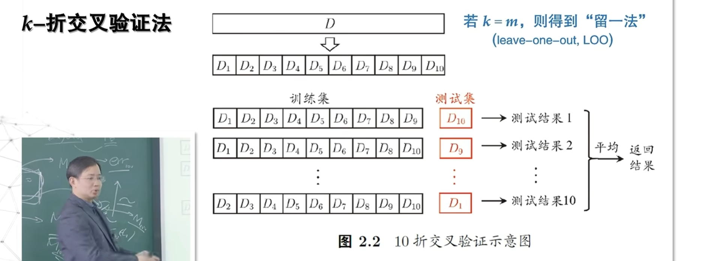
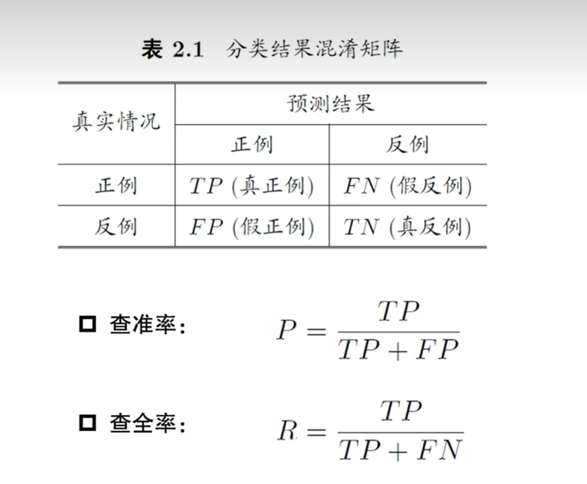
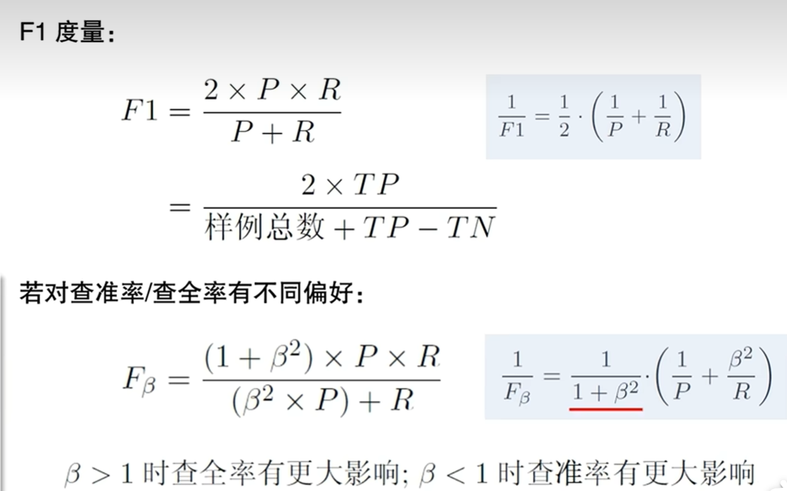
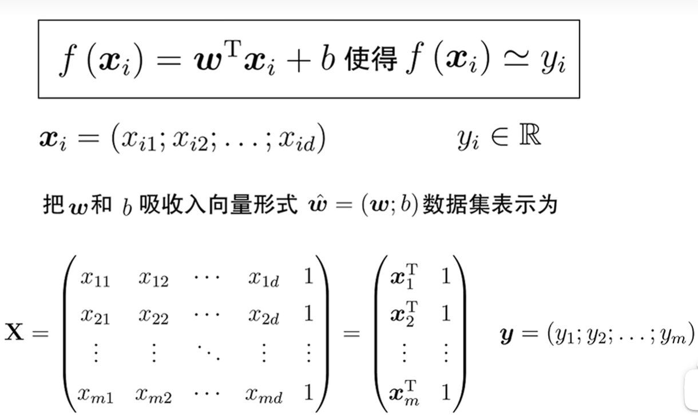
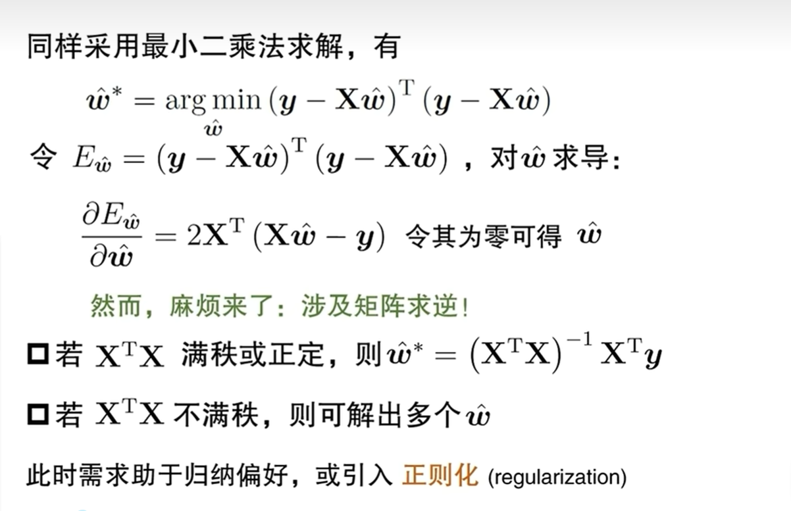

[关于自主采样法Bootstrap的介绍](https://blog.csdn.net/sdf57/article/details/119063276)

[上述概念的精确定义, 例子](https://blog.csdn.net/weixin_41645791/article/details/145786937)

想要对比不同模型在查全率&查准率上的综合表现, 可以综合查准率和查全率, 得出判别指标F1
并且可以对查准率和查全率的重要性做一些**自定义**--调节参数\(\beta\)

### 线性回归
一元线性回归数理统计里头讲过.
多元线性回顾:

上面的矩阵运算里面涉及到求逆矩阵.如果不可逆, 怎么办?
[关于矩阵运算, 岭回归&正则化的补充材料](https://blog.csdn.net/MoreAction_/article/details/125004112)

另:广义线性回归.指处理后的数据满足线性回归关系.如下的对数线性回归是一个例子:
$$
\ln{\mathbf{y}}=\mathbf{w}^T \mathbf{x}+\mathbf{b}
$$

### 线性判别分析(Linear criminant Analysis, LDA)
