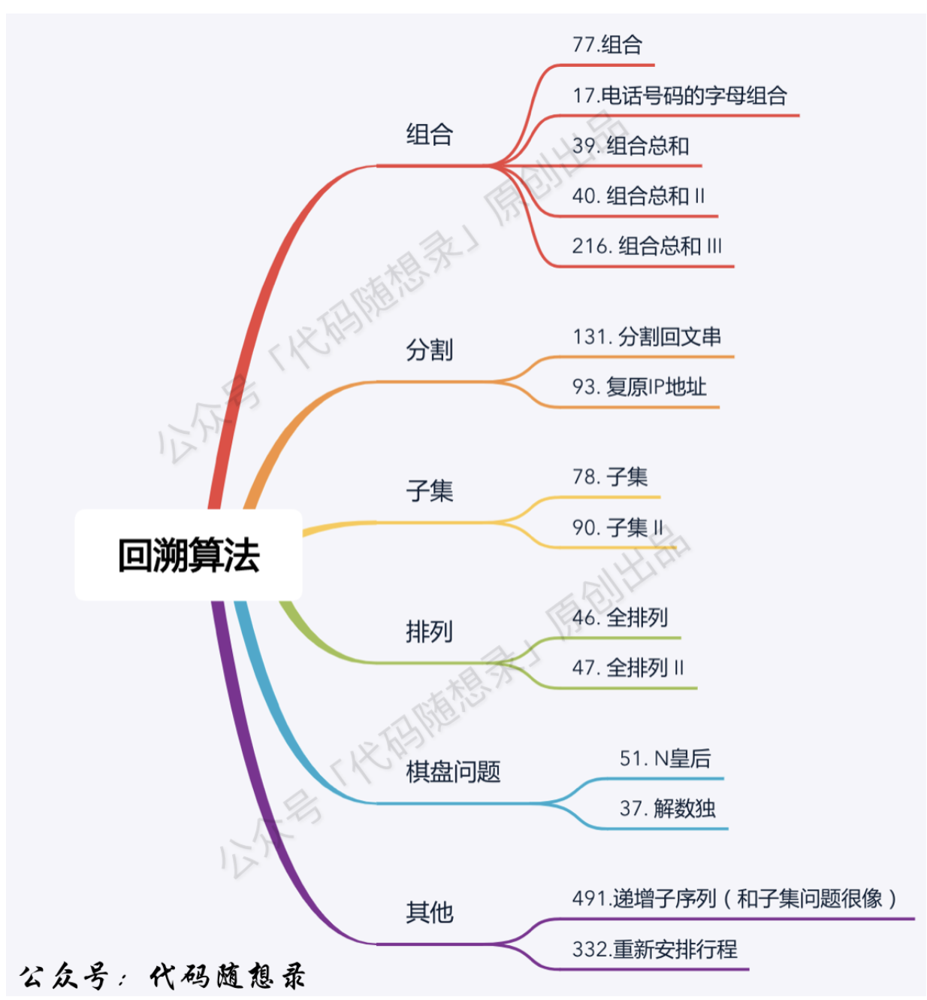

专门给回溯算法做的仓库.

回溯代码通用结构: 
```text
void backtracking(参数) {
    if (终⽌条件) {
        存放结果;
        return;
    }
    for (选择：本层集合中元素（树中节点孩⼦的数量就是集合的⼤⼩）) {
        处理节点;
        backtracking(路径，选择列表); // 递归
        回溯，撤销处理结果
    }
}
```

题目来源: 

参考资料: 代码随想录