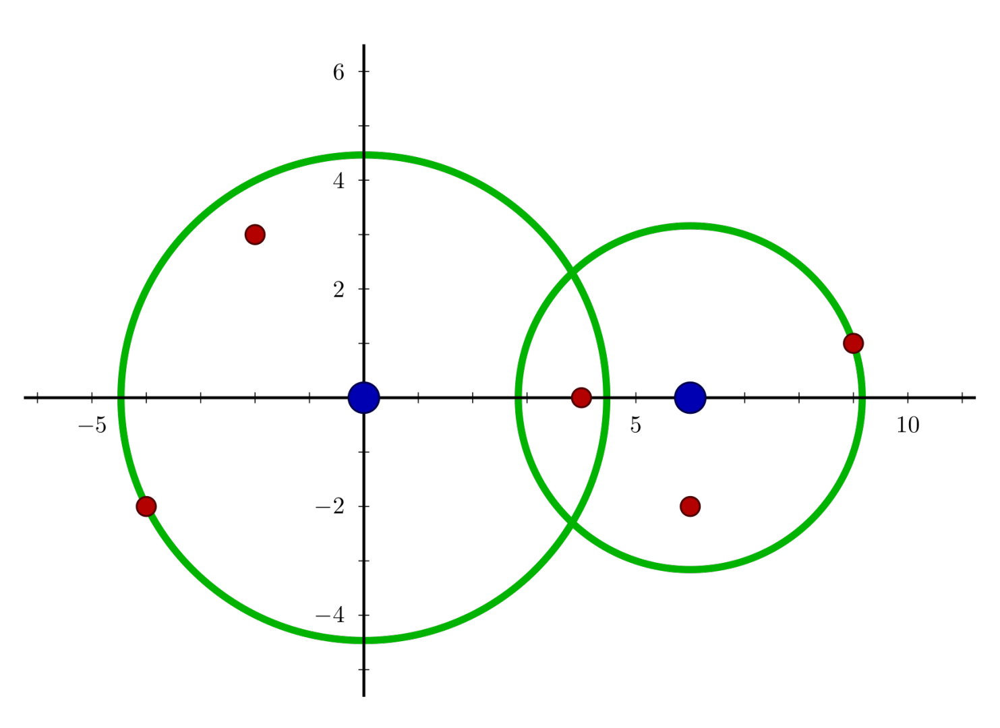

## 问题描述
经过 11 年的韬光养晦，某国研发出了一种新的导弹拦截系统，凡是与它的距离不超过其工作半径的导弹都能够被它成功拦截。当工作半径为 0 时，则能够拦截与它位置恰好相同的导弹。但该导弹拦截系统也存在这样的缺陷：每套系统每天只能设定一次工作半径。而当天的使用代价，就是所有系统工作半径的平方和。

某天，雷达捕捉到敌国的导弹来袭。由于该系统尚处于试验阶段，所以只有两套系统投入工作。如果现在的要求是拦截所有的导弹，请计算这一天的最小使用代价。

## 输入形式
第一行包含 4 个整数$x_1, y_1, x_2, y_2$, 每两个整数之间用一个空格隔开，表示这两套导弹拦截系统的坐标分别为:$(x_1, y_1)$, $(x_2, y_2)$

第二行包含 1 个整数 N，表示有 N 颗导弹。接下来 N 行，每行两个整数 x,y，中间用一个空格隔开，表示一颗导弹的坐标 :$(x, y)$. 不同导弹的坐标可能相同。

## 输出形式
一个整数，即当天的最小使用代价。

## 样例1
- 输入:
```
0 0 10 0
2
-3 3
10 0
```
- 输出: 18
要拦截所有导弹，在满足最小使用代价的前提下，两套系统工作半径的平方分别为 18 和 0。


## 样例2
- 输入
```
0 0 6 0
5
-4 -2
-2 3
4 0
6 -2
9 1
```
- 输出: 30
- 说明
  样例 2 中的导弹拦截系统和导弹所在的位置如下图所示。要拦截所有导弹，在满足最小使用代价的前提下，两套系统工作半径的平方分别为 20 和 10。

