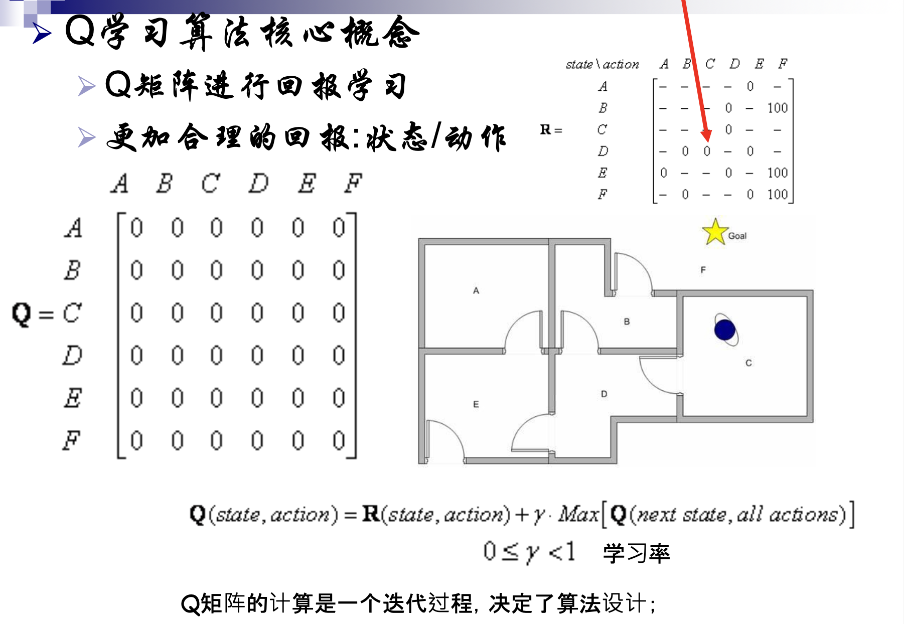
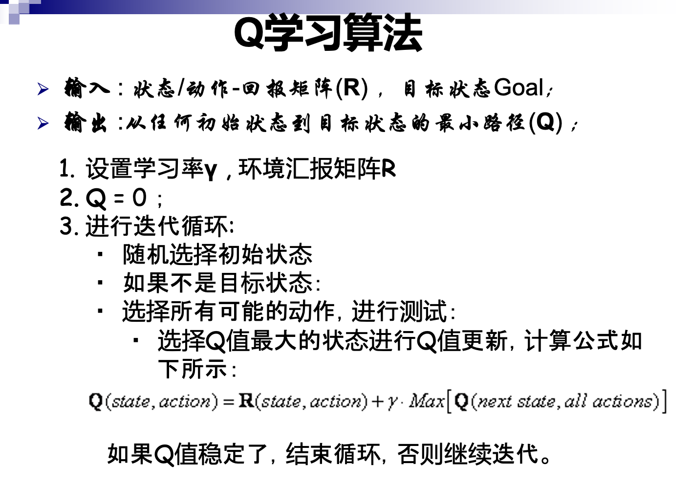

## Q学习
### 什么是Q 学习?
> 基于状态, 动作, 奖励三个要素, 指导智能体在对应环境下做出适当动作反应

### 一个例子:走出房间
[例子](https://cloud.tencent.com/developer/article/2163196)
- 任务目标:处于任何一个房间的机器人都能够找到一条最优路径走到室外
- 通过图论建模该问题
- 每条边的权重 相当于 一个房间走到另一个房间的奖励. 由于目标是走出房间, 因此走出房间的边奖励值更大(100), 没走出房间的边奖励值为 0
- 将边的权值通过邻接矩阵的方式存储

### 操作
- 需要先设定执行动作的规则
  - 假设规则是每次选择奖励最大的边(贪心), 但可能会在某些点困住, 因为有些节点边少, 且存在的边数值都是 0

- 因此, 基于强化学习, 应需要对应修改**行为规则**
  - 设当前这一步, 从A 到 B 房间
  - 对于走到更有可能走出房间的房间 B, 应该增加A 到 B的奖励
  - 也即, 考虑当下动作所带来的未来所带来的回报(不管是正增益 or 负增益
  - 
  - 具体算法 

## 决策树学习
- 非根节点定义规则, 根节点定义类别

### 信息熵
- 小概率事件信息量大, 事出反常必有妖-一旦发生，就会带来大量新信息
- 定义信息量:$I(a_i)=-\log_{2}{p(a_i)}$
  - 事件$a_i$概率越小, $I(a_i)$越大

- 信息熵
  - 事件 A 有 n 个取值, $A=a_1, a_2...a_n$, 则:
    $$
    H(A)=-\sum_{i=1}^{n}{[p(A=a_i) \cdot \log_{2}{p(A=a_i)]}}
    $$
    - 如何理解这一公式? 为什么还要乘 x_i?
  